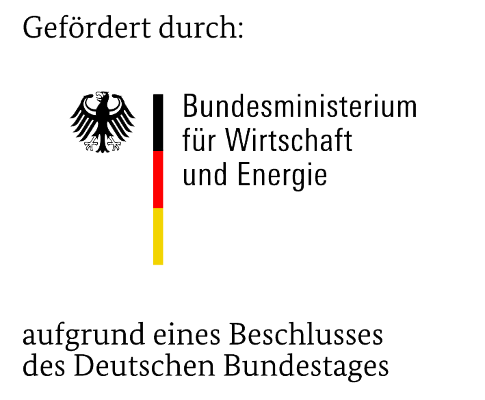

# Honeycombs in Concrete

This repository contains necessary datasets for my thesis _Image-based detection of surface defects in concrete during construction_ . Feel free to use this dataset for non-commercial research.

Use this bibtex to cite this dataset:

```
TBD
```

# Honeycombs in Concrete Instance Segmentation (HiCIS)
The directory `HiCIS` contains two datasets for instance segmentation of honeycombs in concrete in COCO Format. The datasets orginate from images scraped from the internet and the other one is provided by Metis Systems AG. The directory `HiCC/web` contains the dataset using the images from the internet and `HICC/metis` contains the dataset using the images provided by Metis Systems AG as part of the research project _Smart Design and Construction (SDaC)_.

# Honeycombs in Concrete Classification (HiCC)

The directory `HiCC` contains images for binary classification of honeycombs in concrete. The datasets (except `HiCC/cdc-bhc`) were generated by using the instance segmentation of the `HiCIS` dataset. The directories are named according to the following convention: `HiCC/{origin}-s{stride_size}-p{patch_size}`.


The dataset under `HiCC/cdc-bhc` was created by using the multi-classification dataset of Hung et al., sorting all images but honeycombs images into a single class. Thus creating a binary classification dataset. Please refer to the original author for the dataset `Concrete Damage Classification` ([original repo](https://github.com/tiensu/Concrete_Damage_Classification)) and if you use `HiCC/cdc-bhc` cite their work: 

```
P. Hung, N. Su, and V. Diep, “Surface classification of damaged concrete using
deep convolutional neural network,” Pattern Recognition and Image Analysis,
vol. 29, no. 4, pp. 676–687, 2019.
```

# Acknowledgements

This dataset was created and published at the Metis Systems AG as part of the reserach project smart design and construction (SDaC).
SDaC is the winner of the innovation competition ”Künstliche Intelligenz als Treiber für volkswirtschaftlich relevante Ökosysteme” (translating to ”artificial intelligence as driver for economically relevant ecosystems”) and is funded by the Bundesministeriums für Wirtschaft und Klimaschutz (English: Federal Ministry for Economic Affairs and Climate Action) (BMWi).

